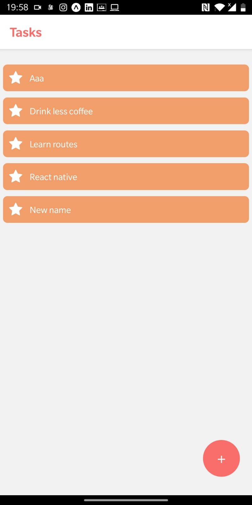
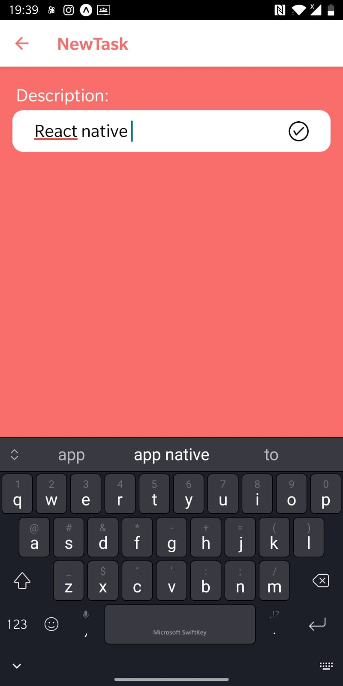
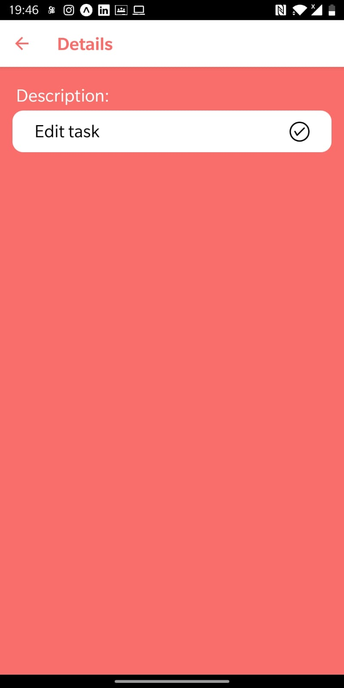

<p align="center">
  
  
  
</p>
<!-- <p>Link para visitar o site : 
<a href="https://taskmangerdany.netlify.app/" />Demo</a>
</p> -->
<p align='center'> Tasks app 40% finish<p/>
<p align="center">
  <a href="#-projeto">Projeto</a>&nbsp;&nbsp;&nbsp;|&nbsp;&nbsp;&nbsp;
   <a href="#-Tecnologias">Tecnologias</a>
<p align="center">
 
  
</p>
<br>

## 🚀 Tecnologias
Esse projeto foi desenvolvido com as seguintes tecnologias:
- java script [ecma6]
- html [Jsx]
- css 
- react-native
- expo
- firebase
## 💻 Projeto

O projeto sera um task manager utilizando a context api, onde os dados ficam salvos no local storage.

## :memo: Licença

Esse projeto está sem licença fique a vontade

# :wrench: How To Run
To run this app on your computer, run these commands inside the repository root folder

case you use yarn just change to yarn and yarn add

```shell
#  install dependencies, run :
$ yarn

# start 
$ yarn start

```


---
